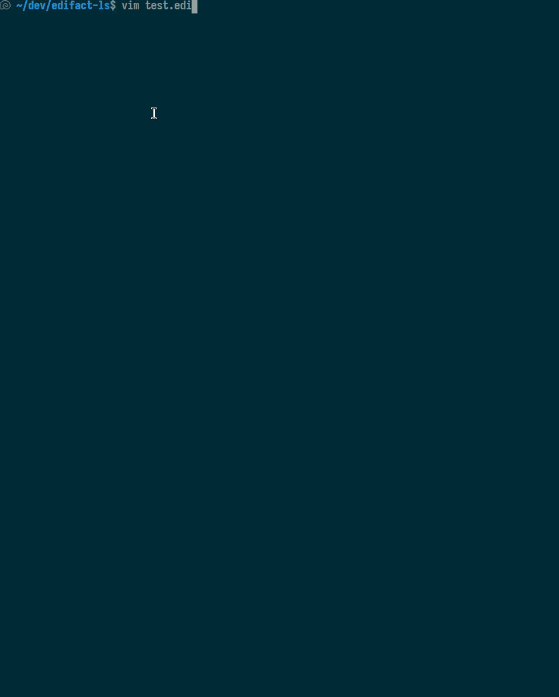

# edifact-ls

A language server for [UN/EDIFACT](https://en.wikipedia.org/wiki/EDIFACT)
files: formatting, syntax highlighting, and linting/validation, designed to
work with Neovim.

Disclamer: This project is 100% generated code.

## Installation

**1. Install the binary onto `$PATH`:**

```sh
go install ./cmd/edifact-ls    # from a checkout of this repo (or: make install)
```

This uses your Go toolchain's normal `$GOBIN`, usually already on `$PATH`.
If you're doing this from an activated Hermit shell in this repo
specifically, note that Hermit points `$GOBIN` at its own `.hermit/go/bin/`,
which is only on `$PATH` while that shell is active — not useful for a
persistent global config. Either install with your own (non-Hermit) Go
toolchain, or point `GOBIN` somewhere already on your `$PATH`, e.g.
`GOBIN="$HOME/.local/bin" go install ./cmd/edifact-ls`.

**2. Copy `editors/nvim/standalone_lsp.lua` into your config** (e.g.
`require`d from your `init.lua`, or its contents pasted in directly). It
registers filetype detection, the LSP server (via built-in
`vim.lsp.config`/`vim.lsp.enable` — no `nvim-lspconfig` dependency required,
though it'll work fine alongside it), and the `:EdifactMinify` command.

**3. For syntax highlighting**, also build and install the tree-sitter
parser (requires Node.js/npm and a C compiler), then copy
`editors/nvim/standalone_treesitter.lua` in the same way:

```sh
cd tree-sitter-edifact
npm install
npx tree-sitter build -o edifact.so
mkdir -p ~/.local/share/edifact-ls
cp edifact.so queries/highlights.scm ~/.local/share/edifact-ls/
```

(Adjust the target directory and `EDIFACT_TS_DIR` at the top of
`standalone_treesitter.lua` together if you'd rather put it somewhere else.)

Both files are self-contained and don't depend on the rest of this repo at
runtime.

### Commands

- `:EdifactMinify` — collapses the current buffer to single-line "wire"
  EDIFACT (segments joined by their terminator only, no newlines). The
  reverse direction is just `vim.lsp.buf.format()` (`textDocument/formatting`),
  since formatting already produces the human-readable multiline form.



## Development

Project status and planned work are tracked as "beans" (via the `beans`
CLI) in `.beans/` — run `beans list --json` or `beans roadmap` to see the
current backlog.

### Requirements

- [Hermit](https://cashapp.github.io/hermit/) manages this repo's toolchain
  (Go, Node.js/npm, `make`, `goreleaser`, `actionlint`, the `beans` CLI).
  Activate it once per shell:

  ```sh
  source bin/activate-hermit
  ```

  (or just prefix commands with `bin/go`, `bin/make`, etc.)

- A C compiler, to build the tree-sitter grammar (`tree-sitter-edifact/`) —
  only required for syntax highlighting; the LSP server, formatting, and
  diagnostics don't need it. Hermit doesn't manage a C toolchain, so this
  has to come from your system.

### Build & test

```sh
make build     # -> dist/edifact-ls
make test      # go vet + go test ./...
make test-e2e  # build + run the headless-nvim e2e harness (see below)
```

### Releasing

Pushing a `vX.Y.Z` tag triggers `.github/workflows/release.yml`, which runs
[goreleaser](https://goreleaser.com/) (config: `.goreleaser.yaml`) to
cross-compile Linux amd64+arm64 binaries, with the version baked in via
`-ldflags`, and publish them as a GitHub Release with a checksums file.

```sh
git tag v0.1.0
git push origin v0.1.0
```

To try the pipeline locally without publishing anything (useful when
editing `.goreleaser.yaml`):

```sh
goreleaser release --snapshot --clean --skip=publish
```

To verify a downloaded release binary:

```sh
tar -xzf edifact-ls_<version>_linux_<arch>.tar.gz
./edifact-ls --version
```

### Trying it in Neovim

`editors/nvim/` holds a minimal, in-repo Neovim config for developing
against a local build — separate from the installation method above (this
one points at an uninstalled local build via an env var instead of
`$PATH`). It registers edifact-ls via Neovim's built-in
`vim.lsp.config`/`vim.lsp.enable` (stable since 0.11), for
`*.edi`/`*.edifact` files.

```sh
make build
EDIFACT_LS_BIN="$(pwd)/dist/edifact-ls" nvim -u editors/nvim/init.lua testdata/minimal.edi
```

Syntax highlighting in this harness is the same
[tree-sitter](https://tree-sitter.github.io/tree-sitter/) grammar in
`tree-sitter-edifact/` described above — see `tree-sitter-edifact/README.md`
for how to build it and enable it here (via
`EDIFACT_TS_PARSER`/`EDIFACT_TS_HIGHLIGHTS`). `scripts/e2e.sh` builds and
wires it in automatically.

### e2e test harness

`scripts/e2e.sh` builds nothing itself (run `make build` first, or use
`make test-e2e` which does both) but does:

1. Locate or download a pinned Neovim into `.tools/` (no manual setup
   needed — safe to run in CI).
2. Build the tree-sitter grammar (`tree-sitter-edifact/`), installing its
   npm dependency on first run.
3. Launch nvim `--headless` with `editors/nvim/init.lua`, pointed at
   `$EDIFACT_LS_BIN` and the built tree-sitter parser.
4. Run `scripts/e2e_check.lua`, which drives real editor behavior (opening
   files, waiting for the LSP client, etc.) and asserts on it.

Exit code is non-zero if any check fails, with a `FAIL: ...` reason on
stderr.

**Adding a new e2e check:** add a fixture under `testdata/` if needed, then
add a `check_*` function to `scripts/e2e_check.lua` following the existing
`check_lsp_attaches` example — call `fail("reason")` on the first problem
found, or `pass("...")` on success. The script calls `cquit 1` if anything
failed, `qa!` (exit 0) otherwise — the `!` is needed because checks may
leave buffers modified without saving (e.g. after formatting/minifying).
